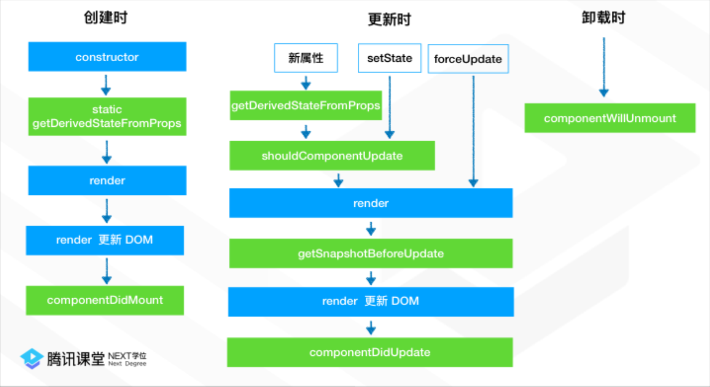

React在v16.3.0的版本中使用了新版的生命周期，本文只对新版的React生命周期展开详解。

## 生命周期流程图



## 组件创建时的生命周期

### static getDerivedStateFromProps(nextProps, prevState)

该周期函数接收两个参数，新的属性作为第一个参数，先前的状态作为第二个参数。当函数返回null时，代表新的属性不需要更新状态；当函数返回了一个对象，对象中的属性则会被更新到State中。如下：
```
static getDerivedStateFromProps(nextProps, prevState) {
    if (prevState.currentId ！== nextProps.itemId) {
        return {
            currentId: nextProps.itemId
        };
    }
    return null;
}
```
上图意思是，当新属性中的 itemId 与当前State的 currentId 不一致时，则执行 currentId 状态的更新，否则返回 null，不执行任何的更新。   
简单来说，如果你的组件中，接收新的属性不需要触发状态的更新，可以忽略该函数，或在该函数中直接返回null;   
值得一提的是，该周期函数是一个静态函数，无法访问组件的实例this，所以在该函数中没办法访问this.props 和 this.state.


### componentDidMount

该函数代表组件实例化完成，这个时候非常适合执行
- 网络请求
- 事件订阅

## 组件更新时的生命周期

### static getDerivedStateFromProps

同组件创建时的getDe函数rivedStateFromProps             

### shouldComponentUpdate(nextPorps, nextState)

该函数接收新的属性作为第一个参数，新的状态作为第二个参数。当函数返回true的时候，周期函数会继续往下执行render渲染；当函数返回false，周期函数则会中止于此，并停止下面的渲染。如果不设置，这个函数会默认返回true。   
利用好这个周期函数的特性，我们可以避免无用的渲染，提升页面的性能。

### getSnapshotBeforeUpdate(prevProps, prevState)

这个周期函数的时期在render之后，组件DOM渲染之前。它让你的组件能在当前的值可能要改变前获得它们。该函数返回的任何值将作为 componentDidUpdate 周期函数的第三个参数。

### componentDidUpdate(prevProps, prevState, snapshot)

componentDidUpdate()会在更新发生后立即被调用。  
当组件被更新时，使用该方法是操作DOM的一次机会。这也是一个适合发送请求的地方，要是你对比了当前属性和之前属性（例如，如果属性没有改变那么请求也就没必要了）。


## 组件挂载时的生命周期：componentWillUnmount

componentWillUnmount()在组件被卸载和销毁之前立刻调用。可以在该方法里处理任何必要的清理工作，例如解绑定时器，取消网络请求，清理任何在componentDidMount环节创建的DOM元素，取消事件订阅。


## 异常处理的周期函数：componentDidCatch

> 错误边界是React组件，并不是损坏的组件树。错误边界捕捉发生在子组件树中任意地方的JavaScript错误，打印错误日志，并且显示回退的用户界面。错误边界捕捉渲染期间、在生命周期方法中和在它们之下整棵树的构造函数中的错误。   
 
如果定义了这一生命周期方法，一个类组件将成为一个错误边界。在错误边界中调用setState()让你捕捉当前树之下未处理的JavaScript错误，并显示回退的用户界面。只使用错误边界来恢复异常，而不要尝试将它们用于控制流。   

以下是一个错误边界组件
```
class ErrorBoundary extends React.Component {
  constructor(props) {
    super(props);
    this.state = { hasError: false };
  }

  componentDidCatch(error, info) {
    // 显示错误发生的回退视图
    this.setState({ hasError: true });
    // 也可以上报错误到服务器
    logErrorToMyService(error, info);
  }

  render() {
    if (this.state.hasError) {
      // 定制任意的回退视图
      return <h1>页面被外星人偷走了</h1>;
    }
    return this.props.children;
  }
}
```
然后将它作为常规组件
```
<ErrorBoundary>
  <MyWidget />
</ErrorBoundary>
```

该componentDidCatch()方法的工作方式类似于JavaScript catch {}块，但适用于组件。只有类组件可以是错误边界。实际上，大多数情况下，您需要声明一次错误边界组件并在整个应用程序中使用它。  
请注意，**错误边界仅捕获组件树中处于它们子层级组件中的错误**。错误边界本身无法捕获错误。如果错误边界尝试呈现错误消息失败，则错误将传播到其上方最接近的错误边界。这也类似于catch {} 在JavaScript中的工作方式。

